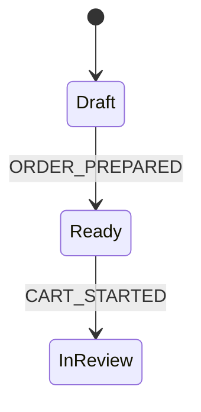

# KDD Graph RAG - Node Types

> **Purpose**: Documentation of node types for indexing KDD specifications in a Graph RAG.

---

## Overview

The KDD Graph RAG indexes the specifications in `/specs` as a knowledge graph. Nodes represent artifacts and their internal elements, while edges represent the relationships between them.

```
┌─────────────────────────────────────────────────────────────┐
│                    GRAPH RAG KDD                            │
├─────────────────────────────────────────────────────────────┤
│  Primary Nodes      →  Artifacts (Entity, Command, UC)      │
│  Secondary Nodes    →  Internal elements (State, Attr)      │
│  Edges              →  Typed relationships (IMPLEMENTS)     │
└─────────────────────────────────────────────────────────────┘
```

---

## Primary Artifacts (Top-Level Nodes)

These are the `.md` documents that exist as independent files in `/specs`.

### Layer 00-requirements

| Type | ID | File Pattern | Description |
|------|----|--------------|-------------|
| `PRD` | - | `PRD.md` | Product Requirements Document |
| `Objective` | OBJ-NNN | `OBJ-NNN-{Name}.md` | Business objective |
| `ValueUnit` | UV-NNN | `UV-NNN-{Name}.md` | Value unit (end-to-end deliverable) |
| `Release` | REL-NNN | `REL-NNN-{Name}.md` | Release plan |

### Layer 01-domain

| Type | ID | File Pattern | Description |
|------|----|--------------|-------------|
| `Entity` | - | `PascalCase.md` | Domain entity |
| `DomainEvent` | EVT-* | `EVT-{Entity}-{Action}.md` | Domain event |
| `BusinessRule` | BR-NNN | `BR-NNN-{Name}.md` | Business rule |

### Layer 02-behavior

| Type | ID | File Pattern | Description |
|------|----|--------------|-------------|
| `Command` | CMD-NNN | `CMD-NNN-{Name}.md` | CQRS command (write) |
| `Query` | QRY-NNN | `QRY-NNN-{Name}.md` | CQRS query (read) |
| `Process` | PROC-NNN | `PROC-NNN-{Name}.md` | Business process |
| `UseCase` | UC-NNN | `UC-NNN-{Name}.md` | Use case |
| `BusinessPolicy` | BP-NNN | `BP-NNN-{Name}.md` | Business policy |
| `CrossPolicy` | XP-NNN | `XP-NNN-{Name}.md` | Cross-cutting policy |

### Layer 03-experience

| Type | ID | File Pattern | Description |
|------|----|--------------|-------------|
| `UIView` | UI-* | `UI-{Name}.md` | UI view/page |
| `UIComponent` | - | `{Name}.md` | Reusable component |

### Layer 04-verification

| Type | ID | File Pattern | Description |
|------|----|--------------|-------------|
| `Requirement` | REQ-NNN | `REQ-NNN-{Name}.md` | Functional requirement |

### Layer 05-architecture (orthogonal)

| Type | ID | File Pattern | Description |
|------|----|--------------|-------------|
| `ADR` | ADR-NNNN | `ADR-NNNN-{Title}.md` | Architecture Decision Record |
| `ImplementationCharter` | - | `charter.md` | Implementation charter |

---

## Secondary Nodes (Internal Elements)

These nodes are extracted from the content of the primary artifacts.

### Lifecycle

| Type | Container | Description |
|------|-----------|-------------|
| `State` | Entity, Process | State in a state machine |
| `StateTransition` | Entity, Process | Transition between states |
| `StateMachine` | Entity | Complete state machine |

**State Properties:**
```yaml
name: string           # State name (e.g.: "Draft")
description: string    # Description
is_initial: boolean    # Is initial state
is_final: boolean      # Is terminal state
```

**StateTransition Properties:**
```yaml
from_state: string     # Source state
to_state: string       # Target state
trigger: string        # Event that triggers the transition
guard: string          # Guard condition (optional)
action: string         # Action to execute (optional)
produces_event: string # Produced event (optional)
```

### Entity Structure

| Type | Container | Description |
|------|-----------|-------------|
| `EntityAttribute` | Entity | Attribute/property |
| `EntityRelationship` | Entity | Relationship with another entity |
| `Invariant` | Entity, BusinessRule | Integrity rule |
| `Constraint` | Entity | Data constraint |

**EntityAttribute Properties:**
```yaml
name: string           # Attribute name
type: string           # Data type
required: boolean      # Is required
description: string    # Description
validation: string     # Validation rule (optional)
default: any           # Default value (optional)
```

**EntityRelationship Properties:**
```yaml
target_entity: string  # Target entity
cardinality: string    # 1:1, 1:N, N:1, N:M
relationship_type: string  # has, belongs_to, associated_with
description: string    # Description
```

### Input/Output

| Type | Container | Description |
|------|-----------|-------------|
| `InputParameter` | Command, Query, Process | Input parameter |
| `OutputField` | Command, Query | Output field |
| `EventPayload` | DomainEvent | Event payload field |

**InputParameter Properties:**
```yaml
name: string           # Parameter name
type: string           # Data type
required: boolean      # Is required
validation: string     # Validation rule
description: string    # Description
```

### Flows

| Type | Container | Description |
|------|-----------|-------------|
| `UseCaseStep` | UseCase | Main flow step |
| `AlternativeFlow` | UseCase | Alternative flow/extension |
| `ProcessStep` | Process | Process step |
| `DecisionPoint` | Process | Decision point |
| `GuardCondition` | Command, StateTransition | Guard condition |

**UseCaseStep Properties:**
```yaml
number: integer        # Step number
actor: string          # Actor who executes (User/System)
action: string         # Action performed
validation: string     # Applied validation (optional)
produces_event: string # Produced event (optional)
```

**AlternativeFlow Properties:**
```yaml
id: string             # Identifier (e.g.: "3a", "5b")
condition: string      # Trigger condition
steps: Step[]          # Alternative flow steps
returns_to: integer    # Step to return to (optional)
```

### UI

| Type | Container | Description |
|------|-----------|-------------|
| `UIInteraction` | UIView, UIComponent | User interaction |
| `ComponentState` | UIComponent | Component visual state |
| `ComponentVariant` | UIComponent | Component variant |
| `FieldValidation` | UIView | Form field validation |
| `UserAction` | UIView, UseCase | User action |

**UIInteraction Properties:**
```yaml
trigger: string        # Trigger event (click, hover, submit)
precondition: string   # Precondition (optional)
action: string         # Executed action
feedback: string       # User feedback
emits_event: string    # Emitted event (optional)
navigates_to: string   # Navigation target (optional)
```

**ComponentState Properties:**
```yaml
name: string           # Name (default, hover, loading, error, disabled)
description: string    # Description
wireframe: string      # ASCII wireframe (optional)
```

### Testing and Verification

| Type | Container | Description |
|------|-----------|-------------|
| `TestScenario` | UseCase, Requirement | Test scenario |
| `AcceptanceCriterion` | Requirement | Acceptance criterion |
| `GherkinScenario` | Requirement | BDD scenario |

**AcceptanceCriterion Properties:**
```yaml
id: string             # Identifier
description: string    # Description
pattern: string        # EARS pattern (optional)
gherkin: GherkinScenario  # Gherkin scenario (optional)
```

**GherkinScenario Properties:**
```yaml
name: string           # Scenario name
given: string[]        # Preconditions
when: string[]         # Actions
then: string[]         # Expected results
```

### Errors

| Type | Container | Description |
|------|-----------|-------------|
| `ErrorCode` | Command, Query | Error code |
| `BusinessRuleException` | BusinessRule | Rule exception |

**ErrorCode Properties:**
```yaml
code: string           # Code (e.g.: "ORDER-003")
condition: string      # Condition that triggers it
message: string        # Error message
http_status: integer   # HTTP status code (optional)
```

---

## Edges (Relationships)

Edges connect nodes and represent semantic relationships.

### Relationships Between Artifacts

| Relationship | From | To | Description |
|--------------|------|----|-------------|
| `IMPLEMENTS` | UseCase | Command, Query | UC invokes operation |
| `PRODUCES` | Command, Process | DomainEvent | Operation generates event |
| `CONSUMES` | Process, Command | DomainEvent | Process reacts to event |
| `VALIDATES` | Command, Query | BusinessRule | Operation validates rule |
| `MODIFIES` | Command | Entity | Command modifies entity |
| `READS` | Query | Entity | Query reads entity |
| `EXTENDS` | UseCase | UseCase | UC extends another UC |
| `INCLUDES` | UseCase | UseCase | UC includes another UC |
| `SUPERSEDES` | ADR | ADR | ADR supersedes another |
| `TRACES_TO` | Requirement | UseCase, BusinessRule | Requirement traceability |
| `ENFORCES` | CrossPolicy | BusinessRule | Policy enforces rule |
| `DELIVERS` | ValueUnit | UseCase | UV delivers through UC |

### Structural Relationships

| Relationship | From | To | Description |
|--------------|------|----|-------------|
| `HAS_ATTRIBUTE` | Entity | EntityAttribute | Entity has attribute |
| `HAS_STATE` | Entity | State | Entity has state |
| `HAS_RELATIONSHIP` | Entity | EntityRelationship | Entity has relationship |
| `HAS_STEP` | UseCase, Process | Step | Artifact has step |
| `HAS_PARAMETER` | Command, Query | InputParameter | Operation has parameter |
| `HAS_ERROR` | Command, Query | ErrorCode | Operation has error |

### Dependency Relationships

| Relationship | From | To | Description |
|--------------|------|----|-------------|
| `REFERENCES` | Any | Any | Generic wiki-link |
| `DEPENDS_ON` | Any | Any | Explicit dependency |
| `RELATED_TO` | Entity | Entity | Domain relationship |

### UI Relationships

| Relationship | From | To | Description |
|--------------|------|----|-------------|
| `DISPLAYS` | UIView | Entity | View displays entity |
| `USES_COMPONENT` | UIView | UIComponent | View uses component |
| `NAVIGATES_TO` | UIView | UIView | Navigation between views |
| `TRIGGERS` | UIInteraction | Command | Interaction invokes command |

### Lifecycle Relationships

| Relationship | From | To | Description |
|--------------|------|----|-------------|
| `TRANSITIONS_TO` | State | State | State transition |
| `TRIGGERED_BY` | StateTransition | DomainEvent | Transition triggered by event |

---

## Cross-Layer Dependencies

References follow the KDD layer dependency model. Higher layers can reference lower layers, never upward.

```
┌─────────────────────────────────────────┐
│  00-requirements (INPUT)                │
│      Feeds design. Outside dep flow.    │
└─────────────────────────────────────────┘
                    ↓ feeds
┌─────────────────────────────────────────┐
│  04-verification                        │
│      ↓ can reference                    │
├─────────────────────────────────────────┤
│  03-experience                          │
│      ↓ can reference                    │
├─────────────────────────────────────────┤
│  02-behavior                            │
│      ↓ can reference                    │
├─────────────────────────────────────────┤
│  01-domain (BASE)                       │
└─────────────────────────────────────────┘

┌─────────────────────────────────────────┐
│  05-architecture (ORTHOGONAL)           │
│      Does not participate in 01→04      │
└─────────────────────────────────────────┘
```

**Valid examples:**
- `UC-001` → `[[CMD-001]]` (02-behavior internal)
- `CMD-001` → `[[Order]]` (02-behavior → 01-domain)
- `REQ-001` → `[[UC-001]]` (04-verification → 02-behavior)
- `UI-Home` → `[[UC-001]]` (03-experience → 02-behavior)

**Invalid examples:**
- `Entity` → `[[UC-001]]` (01-domain → 02-behavior)
- `Command` → `[[UI-Home]]` (02-behavior → 03-experience)

---

## Node Extraction

### From Front-Matter

```yaml
---
id: CMD-001
kind: command
status: approved
---
```

Generates node:
```json
{
  "id": "CMD-001",
  "type": "Command",
  "kind": "command",
  "status": "approved",
  "file": "specs/02-behavior/commands/CMD-001-PlaceOrder.md"
}
```

### From Wiki-Links

```markdown
The [[Customer]] places an [[Order]] validating [[BR-002-OrderTitleLength]].
```

Generates edges:
```json
[
  { "from": "CMD-001", "to": "Customer", "type": "REFERENCES" },
  { "from": "CMD-001", "to": "Order", "type": "MODIFIES" },
  { "from": "CMD-001", "to": "BR-002", "type": "VALIDATES" }
]
```

### From Sections

```markdown
## Attributes

| Attribute | Type | Description |
|-----------|------|-------------|
| title | string | Order title |
| status | enum | Current status |
```

Generates secondary nodes:
```json
[
  { "id": "Order.title", "type": "EntityAttribute", "parent": "Order", "dataType": "string" },
  { "id": "Order.status", "type": "EntityAttribute", "parent": "Order", "dataType": "enum" }
]
```

### From Mermaid Diagrams

```markdown
## Lifecycle



Generates nodes and edges:
```json
{
  "nodes": [
    { "id": "Order.State.Draft", "type": "State", "parent": "Order" },
    { "id": "Order.State.Ready", "type": "State", "parent": "Order" },
    { "id": "Order.State.InReview", "type": "State", "parent": "Order" }
  ],
  "edges": [
    { "from": "Order.State.Draft", "to": "Order.State.Ready", "type": "TRANSITIONS_TO", "trigger": "ORDER_PREPARED" }
  ]
}
```

---

## Base Node Schema

All nodes share these properties:

```yaml
# KDDNode
id: string              # Unique identifier
type: NodeType          # Node type
title: string           # Human-readable title
file: string            # Source file (if applicable)
parent: string          # Parent node (for secondary nodes)
layer: Layer            # KDD layer
status: Status          # Artifact status
metadata: object        # Additional metadata
```

### NodeType

**Primary:**
`Entity`, `DomainEvent`, `BusinessRule`, `BusinessPolicy`, `CrossPolicy`,
`Command`, `Query`, `Process`, `UseCase`,
`UIView`, `UIComponent`,
`Requirement`, `ADR`, `PRD`,
`Objective`, `ValueUnit`, `Release`, `ImplementationCharter`

**Secondary:**
`State`, `StateTransition`, `StateMachine`,
`EntityAttribute`, `EntityRelationship`, `Invariant`, `Constraint`,
`InputParameter`, `OutputField`, `EventPayload`,
`UseCaseStep`, `AlternativeFlow`, `ProcessStep`, `DecisionPoint`, `GuardCondition`,
`UIInteraction`, `ComponentState`, `ComponentVariant`, `FieldValidation`,
`TestScenario`, `AcceptanceCriterion`, `GherkinScenario`,
`ErrorCode`, `BusinessRuleException`

### Layer

`00-requirements`, `01-domain`, `02-behavior`, `03-experience`, `04-verification`, `05-architecture`

### Status

`draft`, `review`, `approved`, `deprecated`, `superseded`

---

## Base Edge Schema

```yaml
# KDDEdge
from: string            # Source node ID
to: string              # Target node ID
type: EdgeType          # Relationship type
metadata:
  trigger: string       # Trigger event (for transitions)
  guard: string         # Guard condition
  description: string   # Relationship description
```

### EdgeType

**Between artifacts:**
`IMPLEMENTS`, `PRODUCES`, `CONSUMES`, `VALIDATES`,
`MODIFIES`, `READS`, `EXTENDS`, `INCLUDES`,
`SUPERSEDES`, `TRACES_TO`, `ENFORCES`, `DELIVERS`

**Structural:**
`HAS_ATTRIBUTE`, `HAS_STATE`, `HAS_RELATIONSHIP`,
`HAS_STEP`, `HAS_PARAMETER`, `HAS_ERROR`

**Dependency:**
`REFERENCES`, `DEPENDS_ON`, `RELATED_TO`

**UI:**
`DISPLAYS`, `USES_COMPONENT`, `NAVIGATES_TO`, `TRIGGERS`

**Lifecycle:**
`TRANSITIONS_TO`, `TRIGGERED_BY`
