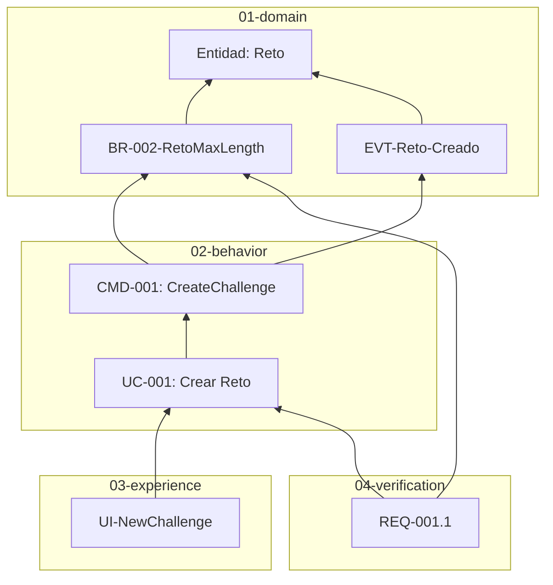

# KDD Trace

Construye y visualiza la matriz de trazabilidad entre capas KDD.

## Cuándo Activarse

Actívate cuando el usuario:
- Quiere entender cómo se conectan los artefactos
- Necesita verificar cobertura de requisitos
- Prepara auditoría o documentación de release
- Pregunta "¿qué depende de X?" o "¿X está cubierto?"

## Estructura de Capas KDD

**IMPORTANTE**: Antes de analizar, verifica la estructura real del proyecto:

```
specs/
├── 00-requirements/     # INPUT: PRD, objetivos, value units, releases
│   ├── PRD.md
│   ├── objectives/      # OBJ-*
│   ├── value-units/     # UV-*
│   └── releases/        # REL-*
│
├── 01-domain/           # BASE: Modelo de dominio (NO referencia capas superiores)
│   ├── entities/        # Entidades del dominio
│   ├── rules/           # Reglas de negocio (BR-NNN-{Name})
│   └── events/          # Eventos de dominio (EVT-*)
│
├── 02-behavior/         # Qué puede hacer el sistema
│   ├── commands/        # Comandos (CMD-*)
│   ├── queries/         # Consultas (QRY-*)
│   ├── processes/       # Procesos orquestados (PROC-*)
│   ├── use-cases/       # Casos de uso (UC-*)
│   └── policies/        # Políticas (BP-*, XP-*)
│
├── 03-experience/       # Cómo interactúa el usuario
│   ├── views/           # Vistas/pantallas (UI-*)
│   └── components/      # Componentes reutilizables
│
├── 04-verification/     # Criterios de aceptación
│   ├── requirements/    # Requisitos verificables (REQ-*)
│   └── examples/        # Escenarios Gherkin (.feature)
│
└── 05-architecture/     # ORTHOGONAL: Decisiones técnicas
    ├── decisions/       # ADRs (técnicos y de requisitos)
    └── charter.md
```

## Reglas de Dependencia entre Capas

**Las capas inferiores NO pueden referenciar capas superiores.**

```
00-requirements  (INPUT — alimenta el diseño, puede mencionar conceptos de dominio)

01-domain        ←─────────────────────────────────┐
       ↓ puede referenciar                         │
02-behavior      ←────────────────────────────┐    │
       ↓ puede referenciar                    │    │
03-experience    ←───────────────────────┐    │    │
       ↓ puede referenciar               │    │    │
04-verification  ────────────────────────┴────┴────┘

05-architecture  (ORTHOGONAL — puede referenciar cualquier capa)

Dependencia del flujo principal: 04 → 03 → 02 → 01
```

### Direccionalidad de Referencias

| Capa Origen | Puede Referenciar | NO Puede Referenciar |
|-------------|-------------------|----------------------|
| `00-requirements` | Puede mencionar conceptos de dominio (INPUT) | No forma parte de la cadena de dependencia |
| `01-domain` | Solo dentro de 01-domain | 02, 03, 04 |
| `02-behavior` | 01-domain, 02-behavior | 03, 04 |
| `03-experience` | 01-domain, 02-behavior | 04 |
| `04-verification` | 01, 02, 03 | - |
| `05-architecture` | Todas las capas (ORTHOGONAL) | - |

### Trazabilidad Válida (dirección correcta)

```
Entidad (01) ← Regla (01) ← Comando (02) ← Use Case (02) ← Vista (03) ← Criterio (04)
    ↑              ↑              ↑              ↑              ↑
    └──────────────┴──────────────┴──────────────┴──────────────┘
                    Referencias hacia capas inferiores (válido)
```

### NO es Trazabilidad Válida

| Situación | Por qué es inválido |
|-----------|---------------------|
| Evento → Comando | 01-domain no puede referenciar 02-behavior |
| Entidad → Vista | 01-domain no puede referenciar 03-experience |
| Regla → Criterio | 01-domain no puede referenciar 04-verification |

## Proceso

### Fase 1: Cargar Estructura Actual

**Antes de analizar**, verifica la estructura real:
```bash
ls specs/*/
```

No asumas estructura - las capas pueden haber cambiado.

### Fase 2: Escanear Artefactos

Lee todos los archivos en `specs/` y extrae:
- IDs de artefactos (UC-001, BR-001-LimiteReto, CMD-001, etc.)
- Wiki-links entre documentos `[[Entidad]]`
- Referencias en frontmatter (`links:`)

### Fase 3: Construir Grafo (respetando direccionalidad)

Genera la matriz de trazabilidad **siguiendo la dirección correcta**:

```markdown
## Matriz de Trazabilidad

### Desde Entidades (01-domain)

| Entidad | Reglas que la usan | Eventos que la afectan |
|---------|-------------------|------------------------|
| [[Reto]] | BR-001..007 (7) | EVT-Reto-* (5) |
| [[Sesión]] | BR-008..013 (6) | EVT-Sesion-* (8) |

### Desde Reglas hacia Capabilities (02)

| Regla | Comandos que la validan | Queries que la consultan |
|-------|-------------------------|--------------------------|
| BR-002-RetoMaxLength | CMD-001, CMD-002 | - |
| BR-008-SesionActiva | CMD-009 | QRY-003 |

### Desde Capabilities hacia Experience (03)

| Comando/UC | Vistas que lo invocan | Flows que lo usan |
|------------|----------------------|-------------------|
| CMD-001 | UI-NewChallenge | FLOW-CrearReto |
| UC-003 | UI-SessionView | - |

### Desde Todo hacia Verification (04)

| Artefacto | Criterios de Aceptación |
|-----------|-------------------------|
| UC-001 | REQ-001.1 a REQ-001.7 |
| BR-002-RetoMaxLength | REQ-001.4 |
```

### Fase 4: Análisis de Cobertura

```markdown
## Análisis de Cobertura

### Resumen
- Total artefactos: 108
- Con trazabilidad completa: 95 (88%)
- Parcialmente trazados: 10 (9%)
- Huérfanos: 3 (3%)

### Por Capa
| Capa | Total | Referenciados por capa superior | Cobertura |
|------|-------|--------------------------------|-----------|
| 01-domain/entities | 14 | 14 | 100% |
| 01-domain/rules | 43 | 40 | 93% |
| 01-domain/events | 20 | 18 | 90% |
| 02-behavior | 43 | 38 | 88% |
| 03-experience | 22 | 20 | 91% |

### Huérfanos (sin ser referenciados)

| Artefacto | Capa | Problema |
|-----------|------|----------|
| BR-LEGACY-001 | 01-domain | Ningún comando lo valida |
| UI-OldComponent | 03-experience | Ningún UC lo referencia |

**Nota**: Huérfanos en 01-domain son más críticos (reglas no usadas).
```

### Fase 5: Visualización (opcional)

Si el usuario lo solicita, genera diagrama Mermaid **respetando direccionalidad**:



**Nota**: Las flechas van de capas superiores a inferiores (dirección de dependencia).

## Modos de Ejecución

### Trazabilidad Completa
Genera matriz completa de todo el proyecto.

### Trazabilidad de Artefacto Específico
Muestra:
- **Hacia abajo**: Qué referencia este artefacto
- **Hacia arriba**: Qué artefactos de capas superiores lo referencian

Ejemplo para `[[Reto]]`:
```markdown
## Trazabilidad: Reto

### Referencias de Reto (hacia abajo)
(Entidad no referencia nada - capa más baja)

### Referenciado por (hacia arriba)
- 01-domain/rules: BR-001..007 (7 reglas)
- 01-domain/events: EVT-Reto-* (5 eventos)
- 02-behavior/commands: CMD-001 a CMD-004
- 02-behavior/use-cases: UC-001, UC-010
- 03-experience/views: UI-RetoCard, UI-RetoList, UI-RetoEditor
- 04-verification/requirements: REQ-001, REQ-010
```

### Trazabilidad de Capa
Muestra conexiones de una capa hacia capas adyacentes.

## Uso en CI/CD

- **Release docs**: Generar matriz de trazabilidad para auditoría
- **PR check**: Verificar que nuevos artefactos tienen trazabilidad
- **Compliance**: Documentar cobertura de requisitos regulatorios

## Skills Relacionados

- `kdd-gaps` - Para detectar huecos específicos
- `kdd-review` - Para revisar calidad de artefactos
- `kdd-iterate` - Para completar cadenas incompletas

## Referencias

- Metodología KDD: `kdd/kdd.md`
- Documentación de capas: `kdd/docs/layers/`
- Matriz existente: `specs/04-verification/requirements/_TRACEABILITY.md`
